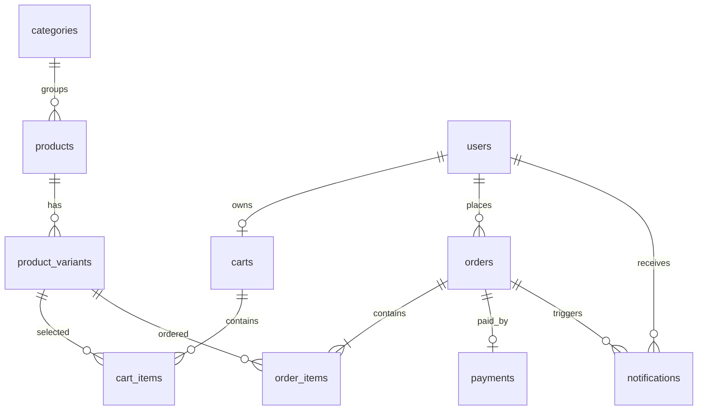

# E-Commerce Mini Backend

Backend Spring Boot 3.5 / Java 21 / MySQL 8. API prefix: `/api`. Database changes are applied by Flyway on startup from `main/resources/db/migration`.

## Run locally — backend only

Open a PowerShell window for the backend:

```powershell
cd C:\DAAAN\shopee\shopee
$env:JAVA_HOME = 'C:\OpenJDK21\jdk-21'
$env:Path = "$env:JAVA_HOME\bin;$env:Path"
$env:DB_USERNAME = 'root'
$env:DB_PASSWORD = '<your-local-mysql-password>'
$env:JWT_SECRET = '<a unique random secret of at least 32 bytes>'
.\mvnw.cmd spring-boot:run
```

This starts only Spring Boot. The backend reads the database URL and application defaults from `src/main/resources/application.properties`; credentials and signing secrets come from environment variables. Start MySQL and ensure the configured `clotherwebsite` database exists. If `JWT_SECRET` is omitted, local development uses a newly generated temporary key and existing tokens become invalid after restart. Set a unique stable `JWT_SECRET` for deployments or multiple backend instances.

At startup, `AdminBootstrap` creates the initial admin when that email does not already exist. Local development defaults are `admin@local` / `123456`; set `ADMIN_EMAIL` and `ADMIN_PASSWORD` to override them. Use a stronger password outside a local development environment.

`DemoDataSeeder` prepares 20 sample customer accounts (`user@local`, `demo-user-02@local` … `demo-user-20@local`, password `123456` by default), 20 clothing products across the catalog categories, product size/color variants, and up to 20 sample rows in each customer-facing transaction table: carts/cart items, orders/order items, payments, and notifications. Orders use varied lifecycle states and sample addresses. Existing categories, products, variants, customer carts, and customer orders are preserved; missing sample rows are filled on startup. Sample orders are created only for sample users who do not already have orders. Override the first sample account with `DEMO_USER_EMAIL` and `DEMO_USER_PASSWORD`, or disable this with `BOOTSTRAP_DEMO_DATA=false`. Seeded customers all have the `USER` role. For a live TiDB database, enable seeding for one successful startup, then set `BOOTSTRAP_DEMO_DATA=false` and redeploy to stop creating sample rows for newly missing sample users.

Clean or build only the backend from this directory:

```powershell
.\mvnw.cmd clean
.\mvnw.cmd package -DskipTests
```

Frontend is a separate project in `C:\DAAAN\shopee\frontend`; use its own PowerShell window and README.
## Main endpoints

| Actor | Endpoint | Purpose |
| --- | --- | --- |
| Public | `POST /api/auth/register`, `POST /api/auth/login` | Register USER and obtain JWT |
| Public | `GET /api/products`, `GET /api/products/{id}` | Search and browse active products and variants |
| Public | `GET /api/products/categories`, `GET /api/products/filters` | Load current categories, sizes, colors and price range for the UI |
| Public | `GET /api/products/{id}/related` | Load other active products from the same category |
| USER | `GET /api/cart`, `POST /api/cart/items`, `PUT /api/cart/items/{id}`, `DELETE /api/cart/items/{id}` | Manage own cart |
| USER | `POST /api/orders`, `GET /api/orders`, `GET /api/orders/{id}` | Checkout and view own orders |
| USER | `GET /api/notifications`, `PUT /api/notifications/{id}/read` | Read own order notifications |
| ADMIN | `GET/POST /api/admin/products`, `PUT/DELETE /api/admin/products/{id}` | Manage products; delete means deactivate |
| ADMIN | `GET/POST /api/admin/categories`, `PUT/DELETE /api/admin/categories/{id}` | Manage categories; deleting a category that still has products returns 409 |
| ADMIN | `POST/PUT/DELETE /api/admin/products/{productId}/variants[/{variantId}]` | Manage product variants |
| ADMIN | `GET /api/admin/orders`, `GET /api/admin/orders/{id}` | View orders |
| ADMIN | `PUT /api/admin/orders/{id}/confirm`, `PUT /api/admin/orders/{id}/cancel` | Transition PENDING order; cancel restores stock |

Send the login token as `Authorization: Bearer <accessToken>`. Responses use JSON; validation errors return 400, missing resources 404, conflicts or invalid order transitions 409, unauthenticated requests 401, and role failures 403.

Registration always creates a `USER`; role cannot be selected in the public registration request. `/api/admin/**` requires `ADMIN`, while cart, order, and notification APIs require `USER`. Public product browsing and authentication remain available without a token. The JWT filter reloads the account role from the database for each request, so changing an account role takes effect without trusting a client-supplied role claim.

The product list returns a page object with `items`, `page`, `size`, `totalElements`, `totalPages`, `first`, and `last`. Example home/catalog request:

```text
GET /api/products?keyword=ao&category=Áo%20thun&size=M&color=Black&minPrice=100000&maxPrice=500000&inStock=true&page=0&pageSize=12&sort=price_asc
```

All filters are optional. `keyword` searches product name and description; `size`, `color`, and `inStock` match a product variant; price bounds apply to the product catalog price. Supported sorts: `newest`, `price_asc`, `price_desc`, `name_asc`, `name_desc`. `page` accepts 0–10,000 and `pageSize` accepts 1–100. Filter options are queried from active catalog data, so the web UI can render the available choices without hard-coded product values.

Products must reference an existing active category. The admin product request accepts a `categoryId`; product responses return both `categoryId` and the category display name. For example:

```json
{
  "name": "Áo thun basic",
  "categoryId": 1,
  "description": "Cotton co giãn",
  "price": 199000,
  "imageUrl": "https://example.com/ao-thun.jpg",
  "status": "ACTIVE"
}
```

`GET /api/admin/categories` returns category IDs, descriptions, active state, and product counts. `GET /api/products/categories` remains a public list of category names available in the active storefront. Migration V5 creates the category table, copies existing product category values into it, and links each product to its category.

## Tables / relationships



Checkout locks cart and variant rows and writes the order, order lines, payment and stock changes in one transaction. Order line prices are snapshots. Confirm/cancel and notification creation share a transaction; cancellation returns each line's quantity to stock.

## Test coverage

The current automated test suite contains a Spring context-load test using an ephemeral H2 database and the `test` profile. It does not yet cover checkout concurrency, authorization scenarios, or complete order lifecycle behavior. The production profile uses MySQL 8 and runs the Flyway schema migrations.
