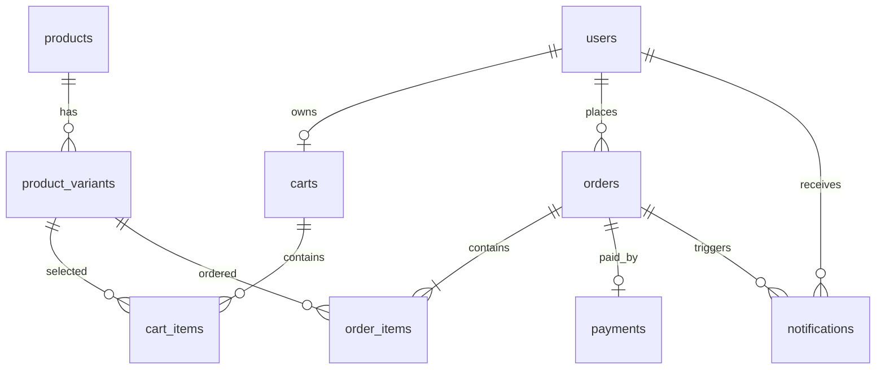

# E-Commerce Mini Backend

Backend Spring Boot 3.5 / Java 21 / MySQL 8. API prefix: `/api`. Database changes are applied by Flyway on startup from `main/resources/db/migration`.

## Run locally — backend only

Open a PowerShell window for the backend:

```powershell
cd C:\DAAAN\shopee\shopee
.\run-backend.ps1
```

This starts only Spring Boot. The backend reads its database and application settings from `src/main/resources/application.properties`; start MySQL and ensure the configured `clotherwebsite` database exists. Java 21 at `C:\OpenJDK21\jdk-21` is selected automatically by `run-backend.ps1` when present.

Clean or build only the backend from this directory; the scripts select Java 21 at `C:\OpenJDK21\jdk-21`:

```powershell
.\clean-backend.ps1
.\build-backend.ps1
```

Frontend is a separate project in `C:\DAAAN\shopee\frontend`; use its own PowerShell window and README.
## Main endpoints

| Actor | Endpoint | Purpose |
| --- | --- | --- |
| Public | `POST /api/auth/register`, `POST /api/auth/login` | Register USER and obtain JWT |
| Public | `GET /api/products`, `GET /api/products/{id}` | Search and browse active products and variants |
| Public | `GET /api/products/categories`, `GET /api/products/filters` | Load current categories, sizes, colors and price range for the UI |
| Public | `GET /api/products/{id}/related` | Load other active products from the same category |
| USER | `GET /api/cart`, `POST /api/cart/items`, `PUT /api/cart/items/{id}`, `DELETE /api/cart/items/{id}` | Manage own cart |
| USER | `POST /api/orders`, `GET /api/orders`, `GET /api/orders/{id}` | Checkout and view own orders |
| USER | `GET /api/notifications`, `PUT /api/notifications/{id}/read` | Read own order notifications |
| ADMIN | `GET/POST /api/admin/products`, `PUT/DELETE /api/admin/products/{id}` | Manage products; delete means deactivate |
| ADMIN | `POST/PUT/DELETE /api/admin/products/{productId}/variants[/{variantId}]` | Manage product variants |
| ADMIN | `GET /api/admin/orders`, `GET /api/admin/orders/{id}` | View orders |
| ADMIN | `PUT /api/admin/orders/{id}/confirm`, `PUT /api/admin/orders/{id}/cancel` | Transition PENDING order; cancel restores stock |

Send the login token as `Authorization: Bearer <accessToken>`. Responses use JSON; validation errors return 400, missing resources 404, conflicts or invalid order transitions 409, unauthenticated requests 401, and role failures 403.

The product list returns a page object with `items`, `page`, `size`, `totalElements`, `totalPages`, `first`, and `last`. Example home/catalog request:

```text
GET /api/products?keyword=ao&category=Áo%20thun&size=M&color=Black&minPrice=100000&maxPrice=500000&inStock=true&page=0&pageSize=12&sort=price_asc
```

All filters are optional. `keyword` searches product name and description; `size`, `color`, and `inStock` match a product variant; price bounds apply to the product catalog price. Supported sorts: `newest`, `price_asc`, `price_desc`, `name_asc`, `name_desc`. `pageSize` accepts 1–100. Filter options are queried from active catalog data, so the web UI can render the available choices without hard-coded product values.

## Tables / relationships



Checkout locks cart and variant rows and writes the order, order lines, payment and stock changes in one transaction. Order line prices are snapshots. Confirm/cancel and notification creation share a transaction; cancellation returns each line's quantity to stock.

## Test coverage

`EcommerceE2ETests` starts an ephemeral H2 database using the test profile. It covers registration/login, product and variant setup, cart, checkout, stock handling, USER/ADMIN authorization, order state changes, notifications, and cross-user access. The production profile remains MySQL 8 and runs the Flyway schema migration.
